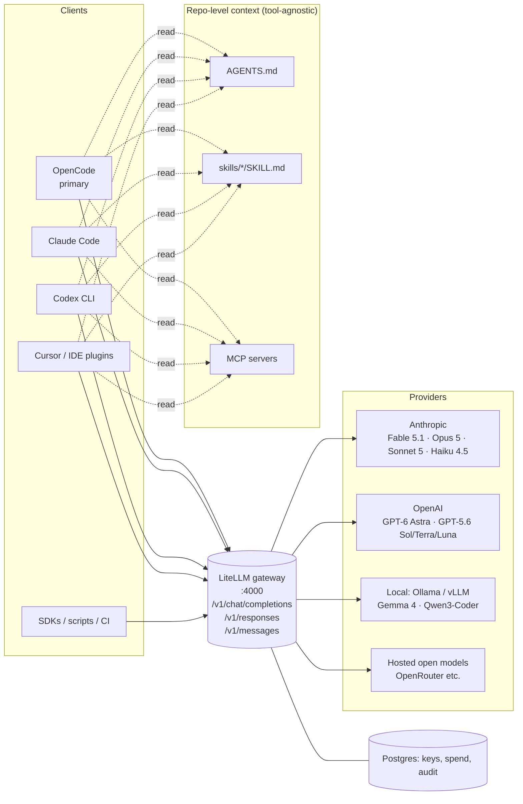

# 00 — Overview and architecture

*Verified: 2026-09-11 against opencode.ai/docs, docs.litellm.ai, platform vendor docs.*

## What this repository is for

You want to use AI coding agents seriously, on your own projects and at work, without
locking yourself to one editor, one vendor or one model. This repository is the reference
you copy from:

- a **gateway** (LiteLLM) that owns vendor credentials, model naming, routing, fallbacks,
  budgets and logs;
- a **primary client** (OpenCode) configured to talk only to that gateway, with agents,
  commands and skills ready to use;
- **portable context** (`AGENTS.md`, skills, MCP declarations) that every other agent tool
  can read, so switching between OpenCode, Claude Code, Codex CLI or Cursor costs nothing;
- **two profiles**, personal and enterprise, that share the same layout and differ only in
  how strict the values are.

## Architecture

Three layers, each replaceable independently:

| Layer | Owns | Replaceable by |
|---|---|---|
| **Providers** | the actual models | any vendor LiteLLM supports (100+), any OpenAI-compatible server |
| **Gateway** | credentials, naming, routing, budgets, logging, guardrails | another gateway that speaks OpenAI + Anthropic wire formats (the client config only changes the base URL) |
| **Clients** | the agent loop, tools, UI | any tool that can set a base URL and an API key |
| **Context** | what the agents know about the repo and how they should behave | nothing; this is the durable asset |

## A request, end to end

1. You type `/review` in OpenCode inside a repo.
2. OpenCode expands the command template, spawns the `reviewer` subagent (read-only, model
   `litellm/coder-fast`), loads `AGENTS.md` and any skill the agent asks for.
3. The request goes to `http://gateway:4000/v1/chat/completions` with a **virtual key**
   issued for OpenCode. The gateway checks the key's model allowlist and budget.
4. `coder-fast` resolves to `anthropic/claude-sonnet-5`. If Anthropic returns a 5xx or 429,
   the router retries, then falls back to `openai/gpt-5.6-terra`.
5. Spend is logged per key (and per team in enterprise mode). The response streams back.

Nothing on your laptop knows the Anthropic or OpenAI key.

## Design principles, expanded

**Gateway first.** A gateway is the only place where the concerns of *many clients × many
vendors* can be solved once: credentials, naming, cost, retries, logs. Without it every tool
holds its own keys and its own idea of which model is "the good one".
See [ADR-0001](adr/0001-gateway-single-entrypoint.md).

**Role aliases, not vendor names.** Clients ask for `coder-fast`, `coder-frontier`,
`reasoning-max`, `coder-cheap`, `coder-local`. Vendor-native names (`claude-opus-5`,
`gpt-6-astra`) are also exposed for tools that need them (Claude Code must see Claude names),
but agent definitions and docs reference roles. Upgrading a model is a one-line gateway
change. See [ADR-0002](adr/0002-role-based-model-aliases.md).

**`AGENTS.md` is canonical.** OpenCode, Codex and Cursor read it natively; Claude Code and
Gemini CLI get a one-line import stub. One file to maintain, no drift.
See [ADR-0003](adr/0003-agents-md-canonical-instructions.md).

**Skills are the unit of reuse.** A skill is a folder with `SKILL.md` plus optional scripts
and references, following the Agent Skills specification. OpenCode, Claude Code and Codex
discover them from `.agents/skills/` (project) and `~/.agents/skills/` (global).
See [ADR-0004](adr/0004-agent-skills-spec.md).

**Local models are part of the ladder.** Cheap exploration, private data and offline work go
to Gemma 4 or Qwen3-Coder on your own hardware. The gateway makes this a routing decision,
not a client reconfiguration.

**Two profiles, one layout.** Personal and enterprise differ in values, not structure, so
knowledge transfers and a personal setup can be hardened rather than rebuilt.
See [ADR-0005](adr/0005-two-profiles.md).

## What is deliberately out of scope

- Fine-tuning, RAG pipelines and evaluation harnesses. This is about *using* agents in
  engineering work, not building model products.
- A specific Kubernetes deployment of the gateway. `gateway/` ships Docker Compose; the
  enterprise doc lists what to change for a managed deployment.
- Non-coding uses (chat assistants, document workflows). The gateway serves them fine, the
  docs do not cover them.

## Reading order

New to all of it: 01 → 02 → 03 → 09. Already run agents: 02 → 05 → 06 → 07.
Rolling out at a company: 08 first, then 02 and 07.
